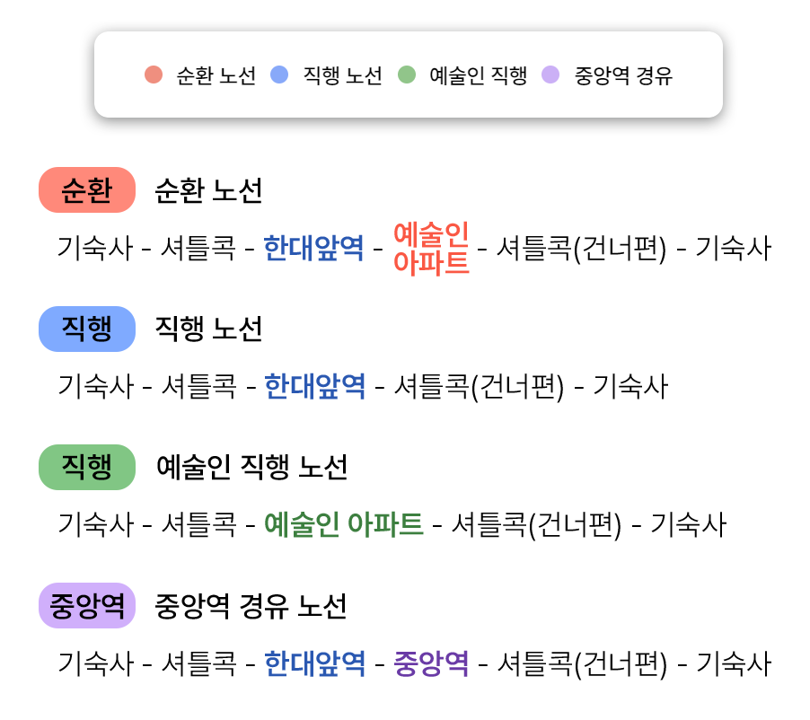

### 버스하냥이란?

버스하냥은 한양대 ERICA 캠퍼스 셔틀버스 시간표를 제공하는 서비스입니다.

공식 홈페이지에 올라오는 PDF를 기반으로 사용자들에게 간편하게 시간표를 제공하고자 제작되었습니다.

더 이상 매번 업데이트되는 PDF를 확인하고, 셔틀 운행 중지 공지를 확인할 필요가 없습니다!

### 운행 노선 안내

### 사용법

최상의 사용경험을 위하여 안드로이드는 크롬, 아이폰 유저들은 사파리 브라우저를 권장합니다.

- https://hybus.app 에 접속해 주세요. (현재 사이트)

안드로이드: 접속 시 하단에 표기된 `홈 화면에 버스하냥 추가` 를 클릭하여 홈 화면에 추가해 주세요. 해당 창이 뜨지 않는다면 크롬 우측 상단에 있는 점3개를 클릭 후 `홈 화면에 추가`를 진행해 주세요.

아이폰: 사파리에서 하단에 공유 버튼을 클릭하여, `홈 화면에 추가` 버튼을 클릭하여 홈 화면에 추가해 주세요.

위와 같은 방법으로 사용하면 웹 서비스지만 앱을 사용하는 것 같은 경험을 느낄 수 있습니다.

### 추가 서비스

아이폰은 아이폰 전용 버스하냥 위젯을 추가할 수 있습니다. 자세한 내용은 [https://ios-widget.hybus.app](https://ios-widget.hybus.app) 에서 확인해 보세요.